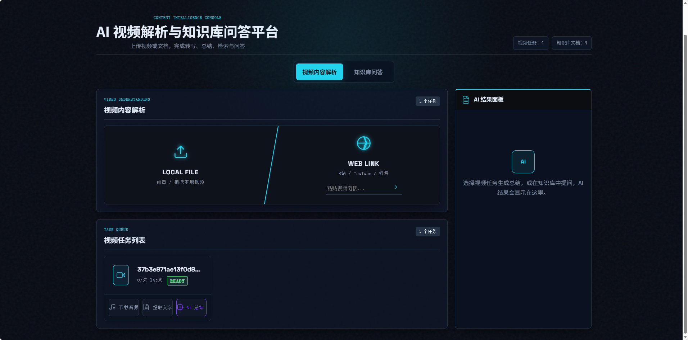
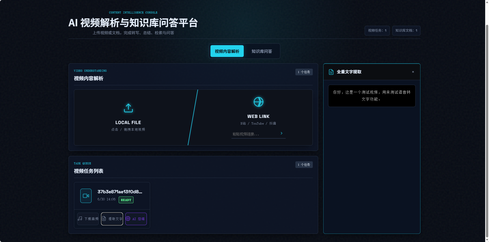
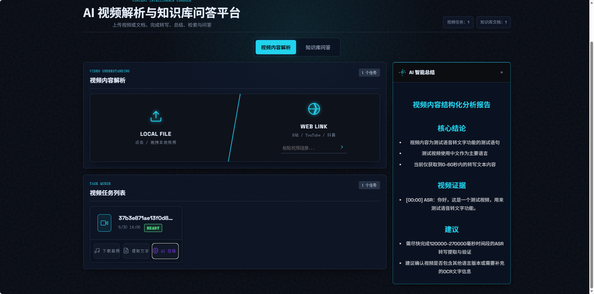
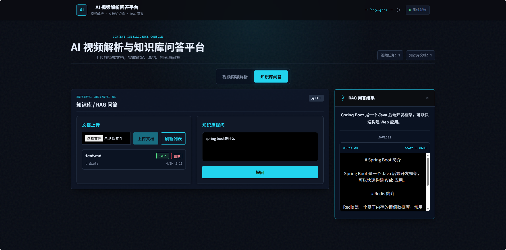
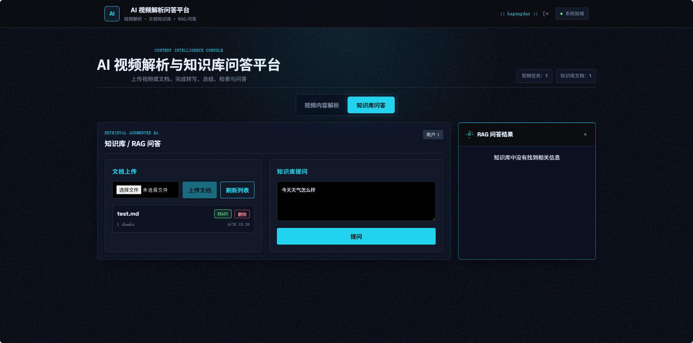

# AI 视频解析与知识库问答平台

一个基于 Spring Boot + Vue 3 的全栈 AI 应用项目，围绕“视频内容理解”和“轻量级知识库问答”两条链路展开。项目支持本地视频上传、URL 视频拉取、分片上传、MinIO 对象存储、RocketMQ 异步视频分析、FFmpeg 音频提取、ASR 转写、AI 总结，以及文档切片、Embedding 检索、RAG 问答和 sources 引用展示。

本项目适合作为 Java 后端实习简历项目展示，重点体现大文件上传、消息队列异步解耦、Redis/Redisson 控制重复提交和限流、AI 服务接入、RAG 检索问答等后端工程能力。

## 项目预览

### 工作台首页



### 视频全文转写



### 视频 AI 总结



### RAG 问答 sources



### 无关问题过滤



## 技术栈

### 后端

- Java 21
- Spring Boot
- MyBatis-Plus
- MySQL
- Redis
- Redisson
- RocketMQ
- MinIO
- LangChain4j
- FFmpeg
- yt-dlp
- SiliconFlow API

### 前端

- Vue 3
- Vite
- JavaScript
- Fetch API / Axios
- marked

### 部署与中间件

- Docker Compose
- MySQL 8.0
- Redis
- MinIO
- RocketMQ NameServer / Broker / Dashboard

## 核心功能

### 视频内容解析

- 支持本地视频上传，并将视频文件保存到 MinIO。
- 支持基于 yt-dlp 的 URL 视频拉取，实际可用性受目标平台规则、网络环境和视频权限限制。
- 支持分片上传、已上传分片查询和合并上传，Redis 记录上传会话和已上传分片下标。
- 支持通过正式接口提交视频分析任务，并将任务投递到 RocketMQ。
- RocketMQ 消费者收到任务后，将耗时 AI 分析逻辑派发到业务线程池异步执行。
- 使用 FFmpeg 提取音频并按片段处理，调用 ASR 服务生成转写文本。
- 支持关键帧抽取和 OCR 识别；关键帧抽取失败时降级为 ASR-only 分析。
- 基于大模型生成结构化视频分析结果。

### 知识库 / RAG 问答

- 支持上传 `txt` / `md` 文档，原文件保存到 MinIO。
- 文档内容按固定长度切片，当前 chunk 大小为 1000 字符，overlap 为 150 字符。
- 使用 SiliconFlow Embedding 接口生成向量。
- Embedding 以 JSON 字符串形式保存到 MySQL，没有引入 Milvus、Qdrant、Elasticsearch 等向量数据库。
- 查询时对用户问题生成 Embedding，在 Java 服务内计算余弦相似度并返回 TopK 片段。
- 问答时将检索到的上下文交给大模型生成答案，并返回 `sources` 引用片段。
- 对低于相似度阈值的结果进行过滤，无相关片段时返回知识库未找到相关信息。
- 支持删除知识库文档及其对应 chunk。

## 核心业务流程

### 视频上传与存储

1. 前端发起本地视频上传或 URL 视频拉取。
2. 普通上传会计算文件 MD5，并将视频上传到 MinIO。
3. 分片上传流程中，后端创建 `uploadId`，Redis 记录文件名、分片总数和用户信息。
4. 每个分片上传成功后，Redis Set 记录已上传分片下标。
5. 合并上传时，后端校验分片数量，本地合并完整文件后上传到 MinIO。
6. MySQL 保存媒体文件记录，Redis 保存 `media:md5:{mediaId}` 内容指纹。

### 异步视频分析

1. 客户端调用正式分析接口 `POST /media/analyze/{mediaId}`。
2. `JwtInterceptor` 验证 Bearer JWT 的签名和有效期，确认 Token 用户仍存在，并将 `userId` 写入 `UserContext`。
3. 读取或计算视频内容指纹 `contentHash`。
4. 使用 Redisson RateLimiter 对 AI 分析入口做全局限流。
5. 使用 Redis `analysis:active:{contentHash}` 防止重复提交。
6. 将 `AnalysisTaskMsg` 投递到 RocketMQ 的 `video-analysis-topic`。
7. RocketMQ 消费者收到任务后，使用 Redisson 分布式锁兜底防重复消费。
8. 消费者将实际 AI 分析派发到线程池执行。
9. 分析完成后写回 MySQL，并释放 Redis activeKey。

### AI 分析链路

视频文件 -> FFmpeg 音频提取 -> ASR 转写 -> 关键帧抽取/OCR -> 构建 VideoContext -> 长视频相关片段召回 -> Planner / Executor / Critic 分析 -> 结构化总结写回 MySQL

### RAG 问答链路

文档上传 -> MinIO 存储 -> 文本切片 -> Embedding 生成 -> MySQL 存储 -> 问题 Embedding -> 余弦相似度 TopK 检索 -> 阈值过滤 -> 大模型生成答案 -> 返回 sources

## 正式视频分析接口

### 提交分析任务

```http
POST /media/analyze/{mediaId}
Authorization: Bearer {{token}}
Content-Type: application/json

{
  "goal": "Summarize the core ideas of this video and return structured conclusions with evidence."
}
```

### 返回状态

- 首次提交成功：返回 `SUBMITTED`。
- 相同视频正在分析：返回 `RUNNING`。
- 未登录或 token 无效：返回 `401`。
- 当前用户不是视频所有者：返回 `403`。
- 超过分析入口限流：返回 `429`。

### 身份说明

正式接口只从 `Authorization: Bearer {{token}}` 获取认证信息。`JwtInterceptor` 验证服务端 HMAC 签名、过期时间和 Token 中的 `userId`，并通过数据库确认用户仍然存在。验证成功后，Controller 从 `UserContext` 读取当前用户；query 参数或请求体中的 `userId` 不作为身份来源。

`/user/login` 返回服务端签名的 JWT，至少包含 `userId`、`username`、签发时间 `iat` 和过期时间 `exp`。伪造的 `user_1`、被修改的 JWT 和已过期 JWT 都会返回 `401`。请求完成后，拦截器在 `afterCompletion` 中清理 `UserContext`，避免 Web 线程复用时泄漏用户身份。

### 前端调用说明

当前前端没有独立的 axios/request 拦截器，统一沿用项目已有的 `fetch` 调用方式。登录成功后，用户信息保存到 `localStorage.user`，登录接口返回的 Token 保存到 `localStorage.authToken`。点击“AI 总结”时发送：

```http
POST /media/analyze/{mediaId}
Authorization: Bearer <signed-jwt>
Content-Type: application/json

{}
```

请求提交期间按钮会禁用；前端函数入口还会同步检查提交状态，避免 DOM 更新前的连续点击产生并发请求。`401` 会清除本地登录状态并要求重新登录，`403` 会提示无权分析，重复任务会原样展示后端的 `Analysis task is already running` 提示。

前端不解析 JWT，也不依赖 Token 的具体字符串格式。`authenticatedFetch` 只负责从 `localStorage.authToken` 读取完整 Token 并添加 Bearer Header。`/media/**` 和 `/knowledge/**` 都使用同一认证入口，登录、注册、Debug 和静态资源不在该拦截范围内。

## 配置说明

运行前需要根据本地环境配置以下变量或配置项。请不要将真实密钥、token、数据库密码提交到仓库。

### 环境变量

- `SILICONFLOW_API_KEY`
- `ALIYUN_API_KEY`
- `YTDLP_PATH`
- `JWT_SECRET`：启动后端前必须设置，至少 32 个 UTF-8 字节；项目不提供默认签名密钥。
- `JWT_EXPIRATION`：JWT 有效期，单位毫秒，默认 `86400000`（24 小时）。

### 关键配置项

配置文件位于 `server/src/main/resources/application.properties`，当前包含：

- `server.port`
- `spring.datasource.url`
- `spring.datasource.username`
- `spring.datasource.password`
- `spring.data.redis.host`
- `spring.data.redis.port`
- `minio.endpoint`
- `minio.accessKey`
- `minio.secretKey`
- `minio.bucketName`
- `ai.deepseek.api-key`
- `ai.deepseek.base-url`
- `ai.deepseek.model`
- `ai.embedding.model`
- `ai.aliyun.api-key`
- `ytdlp.path`
- `tool.ffmpeg.dir`
- `tool.ocr.command`
- `rocketmq.name-server`
- `rocketmq.producer.group`
- `jwt.secret`
- `jwt.expiration`

README 只列出配置名称，不包含真实 API Key、token 或个人本地路径。

当前后端默认端口为 `9090`。Docker Compose 中 MySQL 映射到宿主机 `3307` 端口，应用默认连接的数据库名为 `media_db`。

## 本地启动

### 1. 启动中间件

在项目根目录执行：

```bash
docker compose up -d
```

该命令会启动 MySQL、Redis、MinIO、RocketMQ NameServer、RocketMQ Broker 和 RocketMQ Dashboard。

### 2. 初始化数据库

进入 MySQL 后执行项目提供的 SQL 文件：

```sql
source docs/sql/init_media.sql;
source docs/sql/init_rag.sql;
```

Windows 用户推荐使用 MySQL Workbench、DataGrip 等客户端直接打开并执行以下 SQL 文件；如果使用 MySQL 命令行，`source` 后的路径请按实际当前目录调整。

- `docs/sql/init_media.sql`
- `docs/sql/init_rag.sql`

### 3. 配置环境变量

至少需要配置 AI 服务密钥：

```powershell
[Environment]::SetEnvironmentVariable("SILICONFLOW_API_KEY", "YOUR_KEY", "User")
```

如果使用 URL 视频拉取能力，需要安装 yt-dlp，并配置：

```powershell
[Environment]::SetEnvironmentVariable("YTDLP_PATH", "YOUR_YTDLP_EXECUTABLE", "User")
```

设置用户级环境变量后，需要重新打开终端或重启 IDEA，后端进程才能读取到新值。

项目不提供 JWT 默认密钥。启动后端前必须设置至少 32 个 UTF-8 字节的 `JWT_SECRET`，不要将真实密钥写入源码、README、`test.http` 或提交记录：

```powershell
$jwtSecret = Read-Host "请输入至少 32 字节的随机 JWT 密钥"
[Environment]::SetEnvironmentVariable("JWT_SECRET", $jwtSecret, "User")
```

如需使用特定 FFmpeg 安装目录，可调整 `tool.ffmpeg.dir`；同时确保 `ffmpeg` 命令可被后端进程调用。

OCR 默认命令为 `tesseract`。如果单帧 OCR 识别失败，该帧 OCR 文本会置空，分析仍可基于 ASR 继续；如果关键帧抽取流程整体失败，则降级为 ASR-only。

### 4. 启动后端

```bash
cd server
.\mvnw.cmd spring-boot:run
```

默认后端地址：

```text
http://localhost:9090
```

默认不激活任何 Spring Profile，因此 `DebugController` 不会注册，正式业务入口不受影响。本地确实需要 `/debug/**` 调试接口时，在当前 PowerShell 会话显式启用 `dev`：

```powershell
cd server
$env:SPRING_PROFILES_ACTIVE = "dev"
.\mvnw.cmd spring-boot:run
```

关闭该终端或执行 `Remove-Item Env:SPRING_PROFILES_ACTIVE` 后，再启动后端即恢复非 dev 模式。项目没有把 `dev` 设为默认 Profile，所以不会因为环境隔离改变原来的普通启动方式。

### 5. 启动前端

```bash
cd client
npm install
npm run dev
```

前端开发服务启动后，按终端输出的本地地址访问页面。

## 测试说明

仓库根目录提供了 `test.http`，包含用户 1/用户 2 登录并动态保存 JWT、正常提交、无 Token、伪造 `user_1`、JWT 篡改、JWT 过期、越权访问、重复提交以及 dev/非 dev 调试接口检查模板。

只需填写测试用户名、密码和属于用户 1 的 `mediaId` 占位符。JWT 由 HTTP Client 在登录请求后保存为运行时变量，不要把真实 Token、密码或 JWT 密钥写入仓库。过期测试可临时用 `JWT_EXPIRATION=1` 启动后端，验证后必须恢复正常配置。首次提交和重复提交应连续执行；可结合 RocketMQ 消费日志以及 Redis 的 `analysis:active:{contentHash}` 检查只投递一次。

## 项目亮点

- 大文件分片上传：支持上传初始化、分片上传、已上传分片查询和合并上传。
- MinIO 对象存储：统一保存视频文件和知识库文档。
- RocketMQ 异步解耦：将长耗时视频分析从 HTTP 请求链路中拆出。
- Redis 防重复提交：使用内容指纹和 activeKey 避免重复分析任务。
- Redisson 限流与分布式锁：限制 AI 分析入口调用频率，并在消费侧兜底防重复处理。
- 用户与资源权限校验：正式分析接口校验当前用户是否拥有目标视频。
- AI 总结：结合 ASR、OCR 和大模型生成结构化视频分析结果。
- RAG 问答：支持文档切片、Embedding 检索、阈值过滤和 sources 引用展示。

## 注意事项

- 本项目不包含任何真实 API Key，运行前需要自行配置环境变量。
- URL 视频拉取能力受目标平台规则、网络环境和视频权限限制。
- 当前 RAG 实现为轻量版本，Embedding 存储在 MySQL 中，适合学习和项目展示。
- 当前使用服务端 HMAC 签名 JWT；启动后端前必须提供至少 32 字节的 `JWT_SECRET`，生产环境还应配合 HTTPS 传输。
