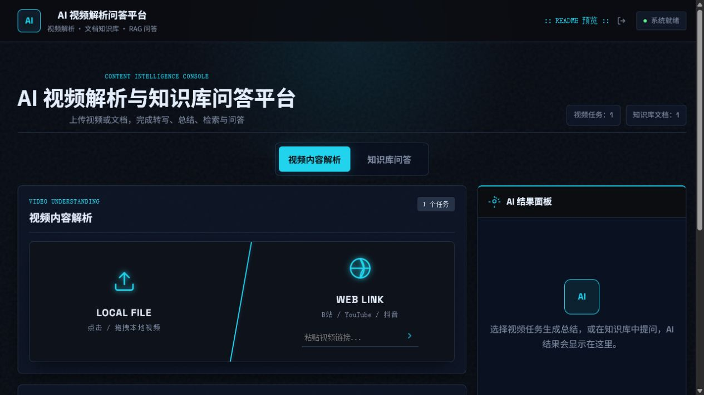
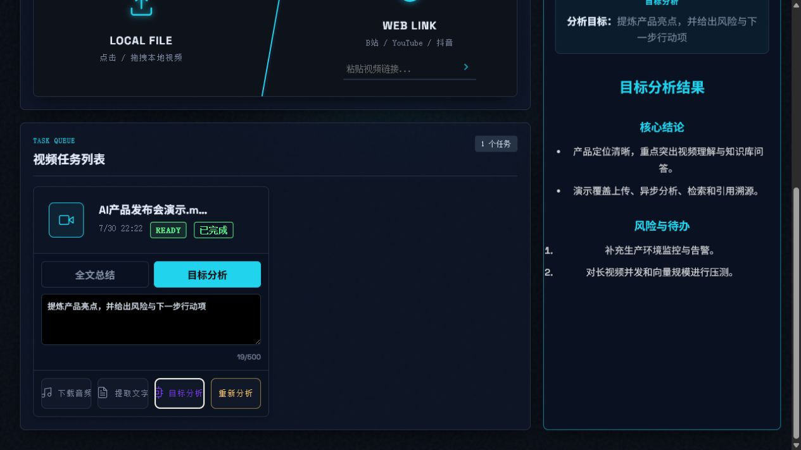
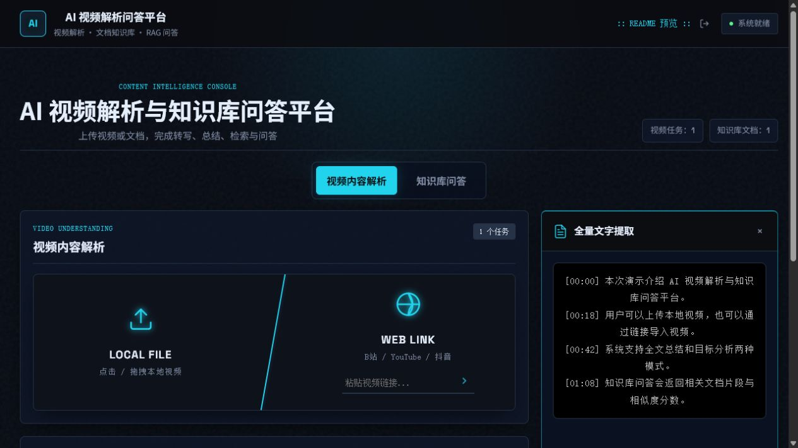
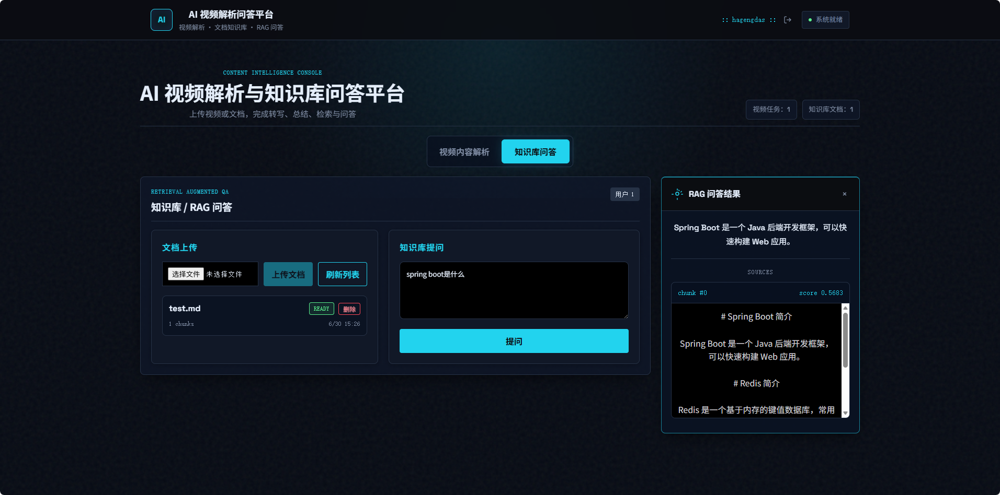
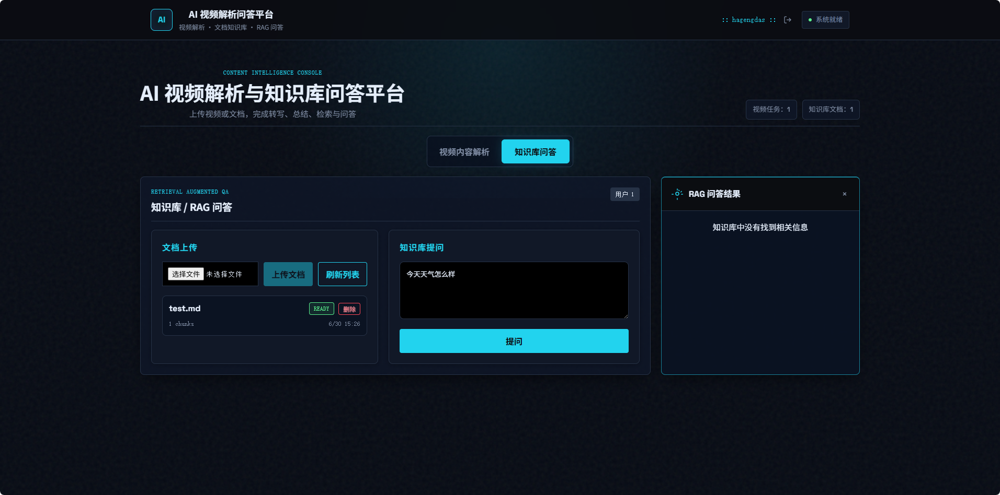
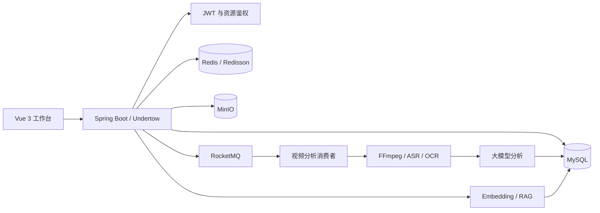

# AI 视频解析与知识库问答平台

一个基于 Spring Boot 3 + Vue 3 的全栈 AI 应用，围绕“视频内容理解”和“轻量级知识库问答”两条链路展开。

项目支持本地视频与 URL 视频导入、5 MB 分片断点续传、MinIO 对象存储、RocketMQ 异步分析、FFmpeg 音频提取、ASR 转写、关键帧 OCR，以及全文总结和目标分析两种 AI 分析模式。知识库侧支持文档切片、Embedding 检索、RAG 问答和 sources 引用展示。

当前版本还包含 JWT 鉴权、资源所有权校验、分析任务状态机、结果复用与强制重新分析、Redis 防重、Redisson 限流/分布式锁，以及 RAG 多租户隔离和持久化一致性保护。

## 项目预览

### 视频工作台



### 全文总结 / 目标分析

每个视频可以选择“全文总结”或“目标分析”。目标分析要求填写不超过 500 字的分析目标；同一模式与目标可直接复用已有结果，也可以显式触发重新分析。



### 视频全文转写



### RAG 问答与引用来源



### 无关问题过滤

当检索结果低于相似度阈值时，系统不会把无关片段交给大模型拼接答案。



## 核心能力

### 视频导入与存储

- 本地视频上传到 MinIO，服务端计算最终文件 MD5，不信任客户端摘要。
- 前端按 5 MB 分片上传；Redis 记录上传会话与已完成分片，支持刷新后续传。
- 合并分片时边写出边计算 MD5，避免为了摘要再次读取完整大文件。
- 支持 yt-dlp 拉取 URL 视频，实际可用性受目标平台规则、网络环境和视频权限影响。
- `media_files.content_hash` 保存内容指纹，Redis 提供 24 小时读取缓存。

### 双模式视频分析

- `FULL`：使用系统内置目标生成完整、结构化的视频总结。
- `GOAL`：围绕用户输入的具体目标分析，目标必填且最长 500 字。
- 显式状态机：`NOT_STARTED -> QUEUED -> RUNNING -> SUCCESS / FAILED`。
- 相同模式和目标已有成功结果时返回 `REUSED`，避免重复调用 ASR、OCR 和大模型。
- `force=true` 可强制重新分析；任务执行期间继续保留并展示上一次成功结果。
- 分析失败时记录 `analysis_error`，不会用失败占位文本覆盖旧结果。
- 每次任务使用独立 `analysis_request_id`，数据库条件更新可阻止旧任务覆盖新任务。
- Redis active key、Redisson 全局限流和消费端分布式锁共同处理重复提交与重复消费。

分析链路：

```text
视频文件
  -> FFmpeg 提取/切分音频
  -> 阿里云 ASR 转写
  -> 关键帧抽取与 Tesseract OCR
  -> 构建 VideoContext
  -> 长视频相关片段召回
  -> Planner / Executor / Critic 分析
  -> 结构化结果写回 MySQL
```

关键帧抽取失败时会降级为 ASR-only；单帧 OCR 失败只会丢弃该帧的 OCR 文本，不阻断整条分析任务。

### 知识库与 RAG 问答

- 支持上传 `txt`、`md` 文档，原文件保存到 MinIO。
- 文档生命周期为 `PROCESSING / READY / FAILED`，失败状态和 chunk 清理由独立事务处理。
- 文本按 1000 字符切片，重叠 150 字符。
- 使用 SiliconFlow Embedding 接口生成向量，并以 JSON 形式保存到 MySQL。
- 查询时在 Java 服务内计算余弦相似度；默认 `TopK=5`，可选范围为 1～20。
- 最低相似度阈值为 `0.45`，无有效上下文时返回“知识库中没有找到相关信息”。
- RAG 答案附带 `sources`，包括文档、chunk、相似度和引用片段。
- 文档与 chunk 同时带有 `user_id`，复合外键和条件 SQL 防止跨用户读写。
- 删除仅允许作用于当前用户的 `READY / FAILED` 文档，`PROCESSING` 文档返回冲突。

RAG 链路：

```text
文档上传
  -> MinIO 保存原文件
  -> 文本提取与切片
  -> Embedding 生成
  -> MySQL 持久化
  -> 问题 Embedding
  -> 余弦相似度 TopK 检索
  -> 0.45 阈值过滤
  -> 大模型生成答案
  -> 返回 sources
```

### 用户与权限

- 注册、登录后由服务端签发 HMAC JWT。
- `/media/**` 和 `/knowledge/**` 统一读取 `Authorization: Bearer <token>`。
- `JwtInterceptor` 校验签名、有效期和用户是否仍存在，再把 `userId` 写入 `UserContext`。
- 视频、知识库文档和检索结果都按当前登录用户隔离。
- 请求结束后清理线程本地的 `UserContext`，避免 Web 线程复用导致身份泄漏。
- `/debug/**` 仅在 `dev` Profile 下注册，默认启动不会暴露调试接口。

## 技术栈

| 分类 | 技术 |
| --- | --- |
| 后端 | Java 21、Spring Boot 3.5.9、Undertow、MyBatis-Plus 3.5.9 |
| 鉴权 | JJWT 0.12.6、服务端 HMAC JWT |
| 数据与缓存 | MySQL 8.0、Redis、Redisson 3.23.5 |
| 异步与存储 | RocketMQ 4.9.4、MinIO 8.5.7 |
| AI 与媒体 | LangChain4j 1.16.3、SiliconFlow、阿里云 ASR、FFmpeg、Tesseract、yt-dlp |
| 前端 | Vue 3.5、Vite 7、JavaScript、Fetch API、marked |
| 部署 | Docker Compose |

## 系统结构


```mermaid
flowchart LR
    UI["Vue 3 工作台"] --> API["Spring Boot / Undertow"]
    API --> AUTH["JWT 与资源鉴权"]
    API --> MYSQL[("MySQL")]
    API --> REDIS[("Redis / Redisson")]
    API --> MINIO[("MinIO")]
    API --> MQ["RocketMQ"]
    MQ --> WORKER["视频分析消费者"]
    WORKER --> MEDIA["FFmpeg / ASR / OCR"]
    MEDIA --> LLM["大模型分析"]
    LLM --> MYSQL
    API --> EMB["Embedding / RAG"]
    EMB --> MYSQL
```

## 项目结构

```text
.
├─ client/                         # Vue 3 前端
│  └─ src/App.vue                 # 工作台、鉴权、上传、双模式分析和 RAG UI
├─ server/                         # Spring Boot 后端
│  ├─ src/main/java/.../auth/      # JWT、拦截器和 UserContext
│  ├─ src/main/java/.../consumer/  # RocketMQ 视频分析消费者
│  ├─ src/main/java/.../controller/# REST 接口
│  ├─ src/main/java/.../service/   # 视频分析、RAG 和一致性逻辑
│  └─ src/main/java/.../utils/     # MinIO、ASR、OCR、Embedding、yt-dlp
├─ docs/
│  ├─ images/                      # README 展示图
│  └─ sql/                         # 初始化与升级 SQL
├─ rocketmq/broker.conf
├─ docker-compose.yml
├─ test.http                       # 接口与鉴权场景测试
└─ .env.example                    # 本地配置模板
```

## 环境要求

- JDK 21
- Node.js `^20.19.0` 或 `>=22.12.0`
- Docker Desktop / Docker Compose
- FFmpeg
- Tesseract OCR（可选；缺失时允许降级）
- yt-dlp（仅 URL 视频导入需要）
- 可用的 SiliconFlow API Key
- 可用的阿里云 DashScope API Key（ASR 需要）

## 本地启动

### 1. 准备本地配置

在项目根目录复制配置模板：

```powershell
Copy-Item .env.example .env
```

编辑 `.env`，至少填写 Docker 中间件账号、密码和 `JWT_SECRET`。JWT 密钥必须包含至少 32 个 UTF-8 字节。

后端还需要以下环境变量：

```powershell
$env:SILICONFLOW_API_KEY = "YOUR_SILICONFLOW_KEY"
$env:ALIYUN_API_KEY = "YOUR_DASHSCOPE_KEY"
$env:JWT_SECRET = "YOUR_RANDOM_SECRET_AT_LEAST_32_BYTES"

# 仅 URL 视频导入需要
$env:YTDLP_PATH = "C:\path\to\yt-dlp.exe"
```

如果希望把 `.env` 中的值加载到当前 PowerShell 会话，可执行：

```powershell
Get-Content .env | ForEach-Object {
  if ($_ -match '^([^#=]+)=(.*)$') {
    [Environment]::SetEnvironmentVariable($matches[1], $matches[2], 'Process')
  }
}
```

`.env` 已被 Git 忽略，不要把真实 API Key、密码、JWT 密钥或本地绝对路径提交到仓库。

### 2. 启动中间件

```powershell
docker compose up -d
docker compose ps
```

默认端口：

| 服务 | 地址 |
| --- | --- |
| MySQL | `localhost:3307` |
| Redis | `localhost:6379` |
| MinIO API | `http://localhost:9000` |
| MinIO Console | `http://localhost:9001` |
| RocketMQ NameServer | `localhost:9876` |
| RocketMQ Dashboard | `http://localhost:8180` |

如果本机端口已被占用，请同步修改 `docker-compose.yml` 的端口映射和后端对应配置。

### 3. 初始化数据库

全新数据库按顺序执行：

```sql
source docs/sql/init_media.sql;
USE media_db;
source docs/sql/init_rag.sql;
```

`init_media.sql` 已包含当前的视频分析状态、分析模式和内容指纹字段；全新安装不需要再执行升级脚本。

旧版本数据库升级前必须停止应用生产者与 RocketMQ 消费者，并完成备份。按版本缺失情况执行：

```sql
source docs/sql/migrate_add_media_content_hash.sql;
source docs/sql/migrate_add_analysis_state.sql;
source docs/sql/migrate_add_analysis_mode.sql;
source docs/sql/precheck_rag_safety_consistency.sql;
source docs/sql/migrate_rag_safety_consistency.sql;
```

注意：

- `migrate_add_analysis_state.sql` 是非重复迁移，只能执行一次。
- `migrate_add_analysis_mode.sql` 可重复执行。
- RAG 迁移要求 MySQL 8.0.46，执行前必须审阅只读 precheck 的全部结果。
- MySQL DDL 会隐式提交；不要使用 `mysql --force` 跳过迁移错误。

### 4. 启动后端

```powershell
Set-Location server
.\mvnw.cmd spring-boot:run
```

默认地址：`http://localhost:9090`

需要调试接口时才启用 `dev` Profile：

```powershell
$env:SPRING_PROFILES_ACTIVE = "dev"
.\mvnw.cmd spring-boot:run
```

使用完成后执行 `Remove-Item Env:SPRING_PROFILES_ACTIVE`，避免后续误以调试模式启动。

### 5. 启动前端

打开新的终端：

```powershell
Set-Location client
npm install
npm run dev
```

按 Vite 终端输出访问本地页面，通常为 `http://localhost:5173`。

## 视频分析接口

### 全文总结

```http
POST /media/analyze/{mediaId}
Authorization: Bearer <signed-jwt>
Content-Type: application/json

{
  "mode": "FULL"
}
```

### 目标分析

```http
POST /media/analyze/{mediaId}
Authorization: Bearer <signed-jwt>
Content-Type: application/json

{
  "mode": "GOAL",
  "goal": "提炼视频中的产品风险、待办事项和关键证据"
}
```

强制重新分析：

```http
POST /media/analyze/{mediaId}?force=true
```

返回体中的业务状态：

| 状态 | 含义 |
| --- | --- |
| `SUBMITTED` | 新任务已写入状态并投递到 RocketMQ |
| `RUNNING` | 同一用户与内容已有任务在执行 |
| `REUSED` | 相同模式与目标已有成功结果，直接复用 |

常见 HTTP 状态码：

| HTTP | 场景 |
| --- | --- |
| `200` | 复用已有结果 |
| `202` | 新任务已提交或任务已在运行 |
| `400` | mode/goal 参数不合法 |
| `401` | JWT 缺失、无效或过期 |
| `403` | 当前用户不是视频所有者 |
| `404` | 视频不存在 |
| `409` | 分析状态发生并发冲突 |
| `429` | 超过 AI 分析入口限流 |

## 配置项

主要配置位于 `server/src/main/resources/application.properties`：

| 环境变量 | 用途 |
| --- | --- |
| `MYSQL_USER` / `MYSQL_PASSWORD` | MySQL 连接 |
| `REDIS_PASSWORD` | Redis 鉴权 |
| `MINIO_ROOT_USER` / `MINIO_ROOT_PASSWORD` | MinIO 鉴权 |
| `SILICONFLOW_API_KEY` | 大模型与 Embedding |
| `ALIYUN_API_KEY` | 阿里云 ASR |
| `JWT_SECRET` | JWT HMAC 密钥，至少 32 字节 |
| `JWT_EXPIRATION` | JWT 有效期，默认 `86400000` ms |
| `YTDLP_PATH` | yt-dlp 可执行文件路径 |

还可以调整 `tool.ffmpeg.dir`、`tool.ocr.command`、模型名称、Redis 数据库、MinIO bucket 和 RocketMQ producer 参数。

## 测试与验证

后端测试：

```powershell
Set-Location server
.\mvnw.cmd test
```

前端生产构建：

```powershell
Set-Location client
npm run build
```

根目录的 `test.http` 包含以下接口场景：

- 用户 1 / 用户 2 登录并动态保存 JWT
- 正常提交、重复提交和强制重新分析
- 无 Token、伪造用户、篡改 JWT、过期 JWT
- 跨用户资源访问
- `dev` / 非 `dev` 调试接口检查
- Redis 回源 MySQL、历史内容指纹回填和 active key 防重

## 当前边界

- 当前 RAG 向量以 JSON 保存在 MySQL，并在 Java 内完成相似度计算，适合学习和中小规模演示；大规模数据应迁移到专业向量数据库。
- URL 视频导入依赖第三方平台规则和 yt-dlp 兼容性，不保证所有链接均可解析。
- OCR 与 ASR 的效果受视频清晰度、语言和音质影响。
- 当前用户模块属于项目演示实现；生产环境应增加 BCrypt/Argon2 密码哈希、登录风控、刷新令牌、HTTPS 和密钥托管。
- 生产部署还应补充可观测性、告警、队列堆积处理、对象存储生命周期和定期备份。

## License

[MIT License](LICENSE)
